<!--
  ============================================================================
  SHRAVANI MANE — GITHUB PROFILE README
  ============================================================================
  HOW TO USE THIS FILE
  1. Create a new PUBLIC repository named EXACTLY your GitHub username
     (e.g. if your username is "shravani-mane", repo must be "shravani-mane").
  2. Add this file as README.md in that repository.
  3. GitHub username "maneshrava" is already filled in throughout this file.
  4. LinkedIn and LeetCode links are filled in. Codeforces / HackerRank /
     GeeksforGeeks / CodeChef / Portfolio are still "#" placeholders —
     fill in the ones you use, or delete the badge lines you don't need.
  5. Replace the PROJECT_ONE..FOUR placeholders in "Featured Projects" once
     you're ready to feature specific repos.
  6. For the Snake animation, copy the GitHub Action workflow at the bottom
     of this file into .github/workflows/snake.yml in this same repo.
  7. For WakaTime/Spotify sections, follow the linked setup guides — they
     are optional and commented out by default.
  ============================================================================
-->

<div align="center">

<!-- ANIMATED TOP BORDER -->


<a href="https://git.io/typing-svg">
  
</a>

<br/>


</div>

<br/>

<!-- SEPARATOR -->


## 🧬 About Me


```yaml
whoami:
  name: "Shravani Mane"
  title: "Third Year CSE Undergraduate"
  role: "Vice Chairperson (VCP)"
  focus: ["AI", "Data Science", "Cybersecurity", "Full Stack Development"]
  mission: "Become a Software Engineer at a top product company"
  mantra: "Curious. Obsessed with learning. Always building. Always improving."
```

- 🔭 Currently building projects across **AI, Data Science, Cybersecurity & Full-Stack Web**
- 🌱 Mastering **DSA, Machine Learning, Cloud Computing & System Design**
- 🎯 Long-term goal: crack a **Software Engineering role at a top product company**
- 👩‍💻 Leading as **Vice Chairperson**, driving tech culture & community initiatives
- ⚡ Fun fact: I debug faster with coffee ☕ than without it
- 📫 Reach me at: **shravanimane33@gmail.com**

<br clear="right"/>


## 🛠️ Tech Arsenal

<div align="center">

### 💻 Programming Languages
    

### 🎨 Frontend
   

### ⚙️ Backend
 

### 🗄️ Database & Data Management
 
`Data Management` · `Excel (AI-assisted analysis)`

### ☁️ Cloud & DevOps
    

### 🤖 AI / ML / Data Science *(exploring)*
   

### 🔐 Cybersecurity & Systems *(exploring)*
  
`Computer Networks` · `Operating Systems`

### 🧰 Tools & IDEs
   

### 🖥️ Operating Systems
  

</div>


## 🎯 Current Focus — Learning Roadmap

```mermaid
graph LR
    A[✅ DSA Foundations] --> B[🔄 Advanced DSA + CP]
    B --> C[🔄 Machine Learning]
    C --> D[🔜 Deep Learning]
    D --> E[🔜 Cybersecurity Specialization]
    E --> F[🔜 Cloud & System Design]
    F --> G[🎯 SDE @ Top Product Company]

    style A fill:#00F5FF,stroke:#8A2BE2,color:#0d1117
    style B fill:#00F5FF,stroke:#8A2BE2,color:#0d1117
    style C fill:#8A2BE2,stroke:#00F5FF,color:#fff
    style D fill:#302b63,stroke:#00F5FF,color:#fff
    style E fill:#302b63,stroke:#00F5FF,color:#fff
    style F fill:#0f0c29,stroke:#00F5FF,color:#fff
    style G fill:#0f0c29,stroke:#00F5FF,color:#00F5FF
```

<div align="center">



</div>

> 💡 **Note:** Mermaid diagrams render natively on github.com profile READMEs.


## 📊 GitHub Statistics

<div align="center">

<!-- REPLACE maneshrava IN ALL STATS LINKS BELOW -->


<br/>


<br/>


</div>

### 🏆 Trophies

<div align="center">


</div>

### 🐍 Contribution Snake

<div align="center">

<!--START_SECTION:snake-->

<!--END_SECTION:snake-->

</div>

> ⚙️ **Setup required:** copy the workflow in the [Snake Animation Setup](#-snake-animation-setup) section at the bottom of this file into `.github/workflows/snake.yml`.


## 🌐 Coding Profiles

<div align="center">

<!-- REPLACE ALL "#" WITH YOUR REAL PROFILE LINKS -->
[](https://github.com/maneshrava)
[](https://www.linkedin.com/in/shravani-mane-394a9232a/)
[](https://leetcode.com/u/beingshrawa/)
[](#)
[](#)
[](#)
[](#)
[](#)
[](mailto:shravanimane33@gmail.com)

</div>


## 🚀 Featured Projects

<div align="center">

<!-- REPLACE EACH CARD's REPO NAME WITH YOUR ACTUAL PROJECT REPO -->
<a href="#">
  
</a>
<a href="#">
  
</a>
<a href="#">
  
</a>
<a href="#">
  
</a>

</div>

<details>
<summary>📁 Click to see project descriptions (replace with your own)</summary>

<br/>

| Project | Description | Tech Stack |
|---|---|---|
| **PROJECT_ONE** | One-line punchy description of what it does and the problem it solves. | `Python` `TensorFlow` |
| **PROJECT_TWO** | One-line punchy description of what it does and the problem it solves. | `React` `Node.js` `MongoDB` |
| **PROJECT_THREE** | One-line punchy description of what it does and the problem it solves. | `C++` `DSA` |
| **PROJECT_FOUR** | One-line punchy description of what it does and the problem it solves. | `Python` `Cybersecurity` |

</details>


## 🗺️ Learning Timeline

```text
2023 ─●───────────────────────────────────────────────────────
      │  Started BE in Computer Science Engineering
2024 ─●───────────────────────────────────────────────────────
      │  Mastered DSA fundamentals (Java, C++)
      │  Explored Web Development (MERN Stack)
2025 ─●───────────────────────────────────────────────────────
      │  Elected Vice Chairperson (VCP)
      │  Deep dive into Machine Learning & Data Science
      │  Started exploring Cybersecurity fundamentals
2026 ─●───────────────────────────────────────────────────────
      │  Cloud Computing (AWS) + Docker + Kubernetes
      │  Contributing to Open Source
      │  Targeting SDE roles at top product companies 🎯
──────┴─────────────────────────────────────────────────────▶
```


## 💬 Quote of the Day

<div align="center">


</div>


## 😄 Random Dev Joke

<div align="center">


</div>


## 🎧 Now Playing (Optional — Spotify)

<div align="center">

<!--
  OPTIONAL SECTION — commented out by default.
  Setup guide: https://github.com/kittinan/spotify-github-profile
  1. Fork that repo, connect your Spotify account via the hosted app.
  2. Uncomment the line below and replace YOUR_UNIQUE_ID.


-->

*(Connect your Spotify to show live listening activity here 🎶)*

</div>


## 🏙️ GitHub Skyline (3D Contribution Skyline)

<div align="center">

<!-- Generate your personalized 3D model at https://skyline.github.com/ then embed a screenshot/GIF here -->


*(Visit → [skyline.github.com](https://skyline.github.com/) → enter your username → download your personal 3D contribution model)*

</div>


## 🎲 Fun Facts

<div align="center">

| # | Fact |
|---|---|
| 🧠 | I can debug code faster than I can find my own keys |
| ⏰ | My best code is written between 11 PM and 2 AM |
| 📚 | I've read more documentation than novels this year |
| 🎯 | I once fixed a bug in my sleep — literally dreamt the solution |
| ☕ | Coffee-to-code conversion rate: highly efficient |
| 🧩 | I enjoy competitive programming as much as building products |

</div>


## ⏳ Daily Routine

```python
class ShravaniMane:
    def __init__(self):
        self.day = {
            "06:30": "Wake up + plan the day 🌅",
            "07:30": "College / Classes 🎓",
            "14:00": "DSA + Competitive Programming 🧩",
            "16:00": "AI/ML or Cybersecurity deep-dive 🤖",
            "18:00": "VCP responsibilities & community work 🏛️",
            "20:00": "Build side-projects / Open Source 🛠️",
            "23:00": "Read tech blogs / plan tomorrow 📚",
        }

    def status(self) -> str:
        return "Always building. Always improving. 🚀"


me = ShravaniMane()
print(me.status())
```


## 💻 Terminal Introduction

```bash
shravani@dev-machine:~$ whoami
Shravani Mane

shravani@dev-machine:~$ cat about.txt
Third-year CSE student | Vice Chairperson | Builder of AI, Data Science
& Cybersecurity projects | Aspiring SDE at a top product company

shravani@dev-machine:~$ ls -la ./interests
drwxr-xr-x  artificial-intelligence
drwxr-xr-x  cybersecurity
drwxr-xr-x  data-science
drwxr-xr-x  system-design
drwxr-xr-x  competitive-programming
drwxr-xr-x  open-source

shravani@dev-machine:~$ ./run-life.sh --mode=growth
[OK] Learning DSA...
[OK] Training ML models...
[OK] Scanning for vulnerabilities...
[OK] Shipping side-projects...
[OK] Leading as Vice Chairperson...
[SUCCESS] Process running indefinitely. Ctrl+C will not stop this. 💫

shravani@dev-machine:~$ _
```


## 📈 Skills Progress

<div align="center">

**Java** `██████████████████░░░░░░` 75%
**Python** `██████████████████░░░░░░` 75%
**C / C++** `██████████████████░░░░░░` 75%
**MySQL / Data Management** `████████████████░░░░░░░░` 65%
**MongoDB** `██████████████░░░░░░░░░░` 55%
**Excel (AI-assisted analysis)** `██████████████░░░░░░░░░░` 55%
**Computer Networks & OS** `██████████████░░░░░░░░░░` 55%
**Data Science / Machine Learning** `██████████░░░░░░░░░░░░░░` 40% *(learning by curiosity)*
**Cybersecurity** `██████████░░░░░░░░░░░░░░` 40% *(learning by curiosity)*

</div>

> ✏️ Update these percentages anytime to reflect your real progress.


## 🖥️ ASCII Signature

```text
   _____ _                             _   __  __
  / ____| |                           (_) |  \/  |
 | (___ | |__  _ __ __ ___   ____ _ __  _  | \  / | __ _ _ __   ___
  \___ \| '_ \| '__/ _` \ \ / / _` | '_ \| | | |\/| |/ _` | '_ \ / _ \
  ____) | | | | | | (_| |\ V / (_| | | | | | | |  | | (_| | | | |  __/
 |_____/|_| |_|_|  \__,_| \_/ \__,_|_| |_|_| |_|  |_|\__,_|_| |_|\___|

        >> COMPILING AMBITION... SUCCESS
        >> DEPLOYING GROWTH... SUCCESS
        >> STATUS: ALWAYS ONLINE 🟢
```


<div align="center">

### 🌌 "Code is the closest thing we have to magic. I'm here to master the spell."


**⭐ From [maneshrava](https://github.com/maneshrava) — if this profile inspired you, star a repo and say hi!**

</div>

---

<!--
  ============================================================================
  🐍 SNAKE ANIMATION SETUP (place this in .github/workflows/snake.yml)
  ============================================================================

  name: Generate Snake

  on:
    schedule:
      - cron: "0 */6 * * *"
    workflow_dispatch:
    push:
      branches:
        - main

  jobs:
    generate:
      permissions:
        contents: write
      runs-on: ubuntu-latest
      steps:
        - name: Generate Snake
          uses: Platane/snk@v3
          with:
            github_user_name: ${{ github.repository_owner }}
            outputs: |
              dist/github-contribution-grid-snake.svg
              dist/github-contribution-grid-snake-dark.svg?palette=github-dark
        - name: Push to output branch
          uses: crazy-max/ghaction-github-pages@v4
          with:
            target_branch: output
            build_dir: dist
          env:
            GITHUB_TOKEN: ${{ secrets.GITHUB_TOKEN }}
  ============================================================================

  💡 EXTRA WIDGETS & IDEAS TO EXPLORE
  ----------------------------------------------------------------------------
  - WakaTime weekly coding activity: https://github.com/athul/waka-readme
  - Holopin achievement badges: https://holopin.io
  - GitHub Readme Metrics (deep analytics): https://github.com/lowlighter/metrics
  - Blog post auto-fetch to README: https://github.com/gautamkrishnar/blog-post-workflow
  - Random dev quote widget: https://github.com/yogeshwaran01/quotes-github-readme
  - Animated GitHub profile 3D contribution: https://github.com/yoshi389111/github-profile-3d-contrib
  ============================================================================
-->
