<div align="center">


<br/>

<a href="https://www.linkedin.com/in/shravani-mane-394a9232a/">
  
</a>
<a href="https://github.com/maneshrava">
  
</a>


</div>


## &#9670; About

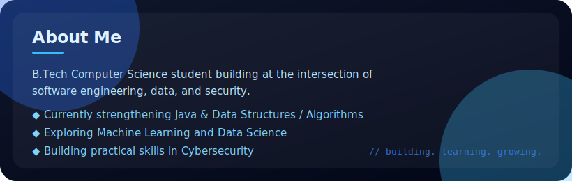

<br/>

```yaml
name: Shravani Mane
role: B.Tech Computer Science Student
focus: [Java, DSA, Data Science, Machine Learning, Cybersecurity]
goal: Land a great internship, ship real projects, contribute to open source
```


## &#9670; Terminal

<div align="center">
  
</div>


## &#9670; Skills

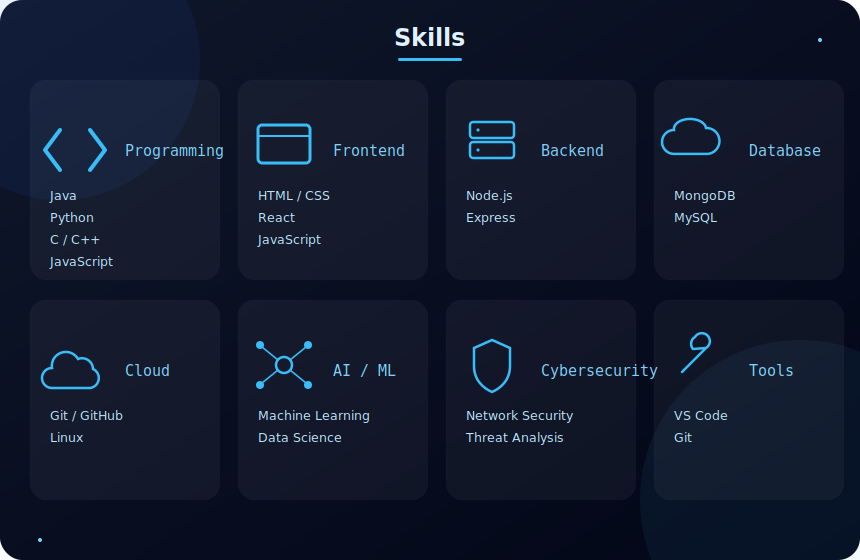


## &#9670; Projects


<br/>


<br/>

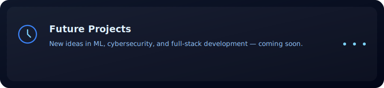


## &#9670; Roadmap



## &#9670; Timeline

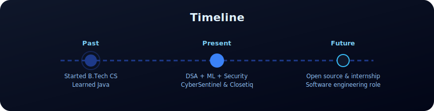


## &#9670; Achievements

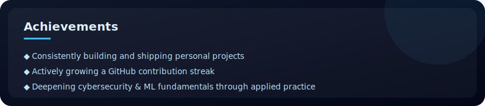


## &#9670; GitHub Stats

<div align="center">


</div>


## &#9670; Contribution Snake

<div align="center">
  
</div>

> Generated automatically by the GitHub Action in `.github/workflows/snake.yml` — see [Setup](#-setup--installation) below.


## &#9670; Contact


<br/>

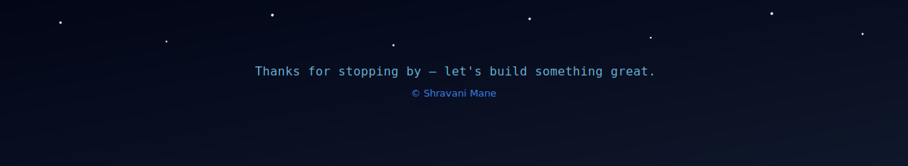

---
